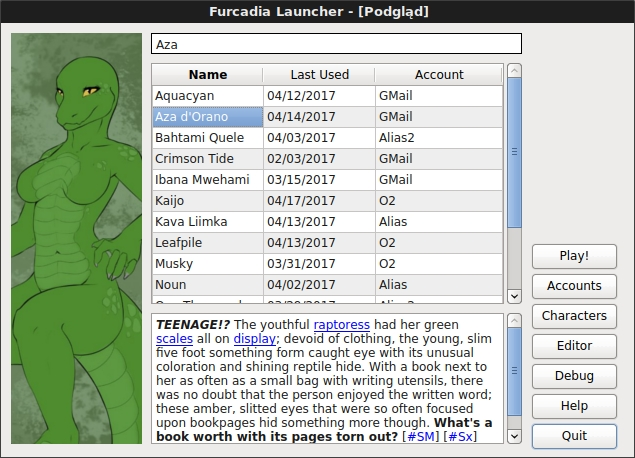

# Furcadia Launcher
A variant launcher for Furcadia written in Common Lisp and (in the future) CommonQt/Qt4.

## Goals
  * Ability to launch Furcadia from command line for any given character, skipping the official launcher. (DONE)
  * Ability to edit descriptions and other attributes as pure text.
  * Ability to show arbitrary images when a given character is selected.
  * Ability to mix characters from different mail accounts on a single list.
  * Ability to automatically refresh characters to prevent them from expiration.

## Mockup
Don't get too excited - it's just a mockup so far, but that's how I imagine the main screen of the launcher to be modeled.

## Current technique

  1. Login into Furcadia CMS.
    a. GET the login page.
    b. Extract the authentication secret from HTML.
    c. POST the login which includes the authentication secret.
  2. Get the furc:// login string.
    a. GET the FurEd page.
    b. Extract the character login secret from HTML.
    c. Fetch the character we want to login as.
    d. POST the character with the character login secret.
    e. Receive the login string from the HTTP response.
  3. Launch Furcadia.
    a. Launch the Furcadia client with the login string as cmdline argument.
